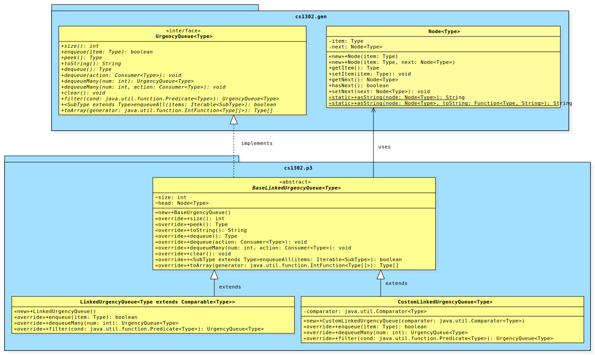

# CSCI 1302 - Urgency Queue v2023.sp


This document contains the description for Urgency Queue
project assigned to the students in the Spring 2023 CSCI 1302 classes
at the University of Georgia.

## Deadline Options

There are different deadline options for this project. Students who
perform their final submission via the `submit` command before the date/times listed
below automatically receive the associated Submission-Based (SB) extra credit. The
late penalty does not start applying until after the final date listed.

* **THU 2023-03-30 (Mar 30) @ 11:55 PM EST (`+10` SB Extra Credit)**
* **FRI 2023-03-31 (Mar 31) @ 11:55 PM EST (`+5` SB Extra Credit)**
* **SUN 2023-04-02 (Apr 2) @ 11:55 PM EST (`+0` SB Extra Credit)**

**Read the entirety of this file before beginning your project.**

**Seriously. Read this entire file *before* starting.**

## Table of Contents

* [Course-Specific Learning Outcomes](#course-specific-learning-outcomes)
* [Academic Honesty](#academic-honesty)
* [Updates](#updates)
* [Project Description](#project-description)
* [Project Requirements & Grading](#project-requirements--grading)
  * [Functional Requirements](#functional-requirements)
  * [Non-Functional Requirements](#non-functional-requirements)
  * [Absolute Requirements](#absolute-requirements)
* [How to Download the Project](#how-to-download-the-project)
* [Submission Instructions](#submission-instructions)
* [Appendix - Suggested Checklist](#appendix---suggested-checklist)
* [Appendix - FAQ](#appendix---faq)

## Course-Specific Learning Outcomes

* **LO1.c:** Create and modify text files and source code using a powerful terminal-based text editor such as Emacs or Vi.
* **LO1.d:** Use shell commands to compile new and existing software solutions that are organized into multi-level
  packages and have external dependencies.
* **LO2.a:** (Partial) Identify redundancy in a set of classes and interfaces, then refactor using inheritance and polymorphism
  to emphasize code reuse.
* **LO2.b:** Define, throw, and propagate exceptions appropriately in a software solution.
* **LO2.d:** Implement new generic methods, interfaces, and classes in a software solution.
* **LO2.e:** Utilize existing generic methods, interfaces, and classes in a software solution.
* **LO3.a:** Create and update source code that adheres to established style guidelines.
* **LO3.b:** Create class, interface, method, and inline documentation that satisfies a set of requirements.
* **LO4.a:** Design, create and use interfaces in a software solution.
* **LO4.b:** Utilize interface-based polymorphism in a software solution.
* **LO4.c:** (Partial) Design, create and use inheritance relationships in a software solution.
* **LO7.c:** Use common abstract data types and structures, including lists, queues, arrays, and stacks in solving
  typical problems.

## Academic Honesty

**You agree to the Academic Honesty policy as outlined in the course syllabus.**
In accordance with this notice, I must caution you **not** to
fork this repository on GitHub if you have an account. Doing so will more than
likely make your copy of the project publicly visible. Please follow the instructions contained
in the [How to Download the Project](#how-to-download-the-project)
section below in order to do your development on Odin. Furthermore, you must adhere
to the copyright notice and licensing information at the bottom of this document.

## Updates

If there has been an update and you have already cloned the project to Odin,
then you can update your copy of the project using the <code>$ git pull</code>
command while inside of your project directory.

## Project Description

In this project, you will be providing two different implementations of
the `UrgencyQueue` interface, which defines different operations that one
should be able to do with a queue of items ordered by their relative level
of urgency. 

An urgency queue is an abstract data type that defines urgency-based queue operations.
From an external (user) perspective, each urgency queue object maintains a "line" of
zero or more *items* (non-null references to objects of the appropriate type). Unlike a 
standard queue, which orders its "line" of items according to FIFO (first-in-first-out)
semantics, an urgency queue associates a *level of urgency* with each item and orders
its items according to their relative level of urgency.

Each implementation of the `UrgencyQueue` interface will be a concrete class with specific functional
and non-functional requirements. These classes need to implement `UrgencyQueue` via a common abstract
parent class.

For this project, you will *NOT* have access to the `.java` files for the
interface. Instead, you will have access to the generated API documentation
for the [`UrgencyQueue` interface](https://cs1302uga.github.io/cs1302-urgency-queue/cs1302uga.gen/cs1302/gen/UrgencyQueue.html)
(may require VPN connection to view).
Implementors should make sure that each method functions or behaves as described
by the interface's API documentation.

Implementors are free to implement additional methods in addition
to the ones defined by the interface. However, they should not assume that
users (e.g., graders) will use these additional methods (even if declared with
`public` visibility), since they are not defined in the interface. These additional
methods may help avoid redundancy and promote code reuse within an implementation.

Based on discussions with past students, we have prepared a
[Suggested Checklist](#appendix---suggested-checklist) section in the Appendices which
contains some suggestions on how to work through the project from start to finish.

### Required Prerequisite Reading

* [1302 Generic Classes Reading](https://github.com/cs1302uga/cs1302-tutorials/blob/alsi/generics/generic-classes/generic-classes.md)
* [1302 Generic Methods Reading](https://github.com/cs1302uga/cs1302-tutorials/blob/alsi/generics/generic-methods/generic-methods.md)
* [1302 Lambda Expressions Reading](https://github.com/cs1302uga/cs1302-tutorials/blob/alsi/lambda/lambda.rst)
* [`java.util.function.Predicate` Interface Documentation](https://docs.oracle.com/en/java/javase/17/docs/api/java.base/java/util/function/Predicate.html)
* [`java.util.function.Consumer` Interface Documentation](https://docs.oracle.com/en/java/javase/17/docs/api/java.base/java/util/function/Consumer.html)

## Project Requirements & Grading

This assignment is worth 100 points. The lowest possible grade is 0, and the
highest possible grade is 110 (due to extra credit).

### Functional Requirements

A functional requirement is *added* to your point total if satisfied.
There will be no partial credit given for visual inspection of your code.
Points are assigned for each test case that executes properly.

For this project, you are required to create two different classes that
implement the same interface via a common abstract parent. While the specific
details are listed later in this document, the following diagram illustrates the
general relationship between your classes and the interface. The package `cs1302.gen`
is provided for you in the `cs1302-urgency-queue.jar` file which is included in the download for the
project (details later). You do not have access to the source
code for classes in `cs1302.gen`. However, you do have access to the _byte code_ and the API
documentation website. You will need to use both `UrgencyQueue` and `Node` in your code since 
`BaseLinkedUrgencyQueue` depends on `UrgencyQueue` and `Node`.



The specific requirements for each class are presented below (See the [Suggested Checklist](#appendix---suggested-checklist)
for the suggested order of implementation).

* **`BaseLinkedUrgencyQueue`:** Create the abstract `cs1302.p3.BaseLinkedUrgencyQueue` class such that it properly
  implements a subset of the abstract methods in the `UrgencyQueue` interface. Since `BaseLinkedUrgencyQueue` is abstract, it is
  not mandatory to implement all methods of `UrgencyQueue` within this class. The exact list of methods this class
  must implement are listed in the method section for `BaseLinkedUrgencyQueue` in the provided UML diagram above.
  Since both `LinkedUrgencyQueue` and `CustomLinkedUrgencyQueue` use a linked list data structure, it is appropriate
  to have `head` as an instance variable of the `BaseLinkedUrgencyQueue` class.

  * **Note:** The methods that are listed in the UML diagram in `BaseLinkedUrgencyQueue` must be implemented
    in that class. You are not allowed to move any of them into either of the chld classes.
    You may, however, find that you can more one or more methods from `LinkedUrgencyQueue` and `CustomLinkedUrgencyQueue`
    up into `BaseLinkedUrgencyQueue`. Moving methods up is allowed. In fact, it is encouraged. Any method that you can
    move up only has to be written once! However, accomplishing this will require some thought. We hope that
    all of you spend some time trying to move additional methods up to `BaseLinkedUrgencyQueue`.

* **`LinkedUrgencyQueue`:** Create the `cs1302.p3.LinkedUrgencyQueue` class such
  that it properly extends `cs1302.p3.BaseLinkedUrgencyQueue` and fully implements
  the `cs1302.gen.UrgencyQueue` interface with additional requirements listed below.

  * The `LinkedUrgencyQueue` implementation of `UrgencyQueue` uses a linked list of `Node` objects to maintain its 
    queue ("line") of items and imposes a 
    [`Comparable` Upper Bound](https://cs1302uga.github.io/cs1302-urgency-queue/cs1302uga.gen/cs1302/gen/UrgencyQueue.html#order-comparable) 
    so that it can compare items. Since each item is compatible with the generic type parameter, `Type`, and `Type` is 
    required to implement `Comparable<Type>`, this class is able to directly determine the relative level of urgency 
    between two items using the natural ordering defined by the item type's `compareTo(Type)` method.
    
  * The starter code for `LinkedUrgencyQueue` contains the class declaration and along with the signature for the default 
    constructor. You are not allowed to change the class declaration or the signature of the constructor.
    
    Here is the class declaration:
    
    ```java
    public class LinkedUrgencyQueue<Type extends Comparable<Type>> implements UrgencyQueue<Type> {
    ```
    
    Here is the signature for the constructor:

    ```java
    public LinkedUrgencyQueue()
    ```
    
  * There is a requirement related to this class's storage included
    in the [Absolute Requirements](#absolute-requirements) section.

* **`CustomLinkedUrgencyQueue`:** Create the `cs1302.p3.CustomLinkedUrgencyQueue` class such
  that it properly extends `cs1302.p3.BaseLinkedUrgencyQueue` and fully implements
  the `cs1302.gen.UrgencyQueue` interface with additional requirements listed below.

  * The `CustomLinkedUrgencyQueue` implementation of `UrgencyQueue` uses a lnked list of `Node` objects to maintain its
    queue ("line") of items and requires a 
    [Comparator Constructor Parameter](https://cs1302uga.github.io/cs1302-urgency-queue/cs1302uga.gen/cs1302/gen/UrgencyQueue.html#order-comparator) 
    so that it can compare items. Although the generic type parameter, `Type`, does not have any explicit upper-bound 
    requirements, this class is still able to determine the relative level of urgency between two items using the 
    ordering imposed by the comparator supplied to the constructor (i.e., it uses comparator's `compare(Type, Type)` method).
  
  * The starter code for `CustomLinkedUrgencyQueue` contains the class declaration and along with the signature for the 
    one-parameter constructor. You are not allowed to change the class declaration or the signature of the constructor.
    
    Here is the class declaration:
    
    ```java
    public class CustomLinkedUrgencyQueue<Type> implements UrgencyQueue<Type> {
    ```
    
    Here is the signature for the constructor:

    ```java
    public CustomLinkedUrgencyQueue(Comparator<Type> cmp) {
    ```


  * There is a requirement related to this class's storage included
    in the [Absolute Requirements](#absolute-requirements) section.

* **(100 points) Test Cases**: The bulk of this project will be graded
  based on 50 or more test cases, each likely worth the same amount of points.
  This is the same as someone using the classes you wrote based purely on
  the interface definitions. If you implement the interface correctly,
  then you should pass the associated test cases.

### Non-Functional Requirements

A non-functional requirement is *subtracted* from your point total if
not satisfied. In order to emphasize the importance of these requirements,
non-compliance results in the full point amount being subtracted from your
point total. That is, they are all or nothing.

* **(0 points) [RECOMMENDED] No Static Variables:** Use of static variables
  is not appropriate for this assignment. However, static constants are
  perfectly fine.
  
  * **(20 points) Code Style Guidelines<a id="style"/>:** You should be consistent with the style
  aspect of your code in order to promote readability. Every `.java` file that
  you include as part of your submission for this project must be in valid style
  as defined in the [CS1302 Code Style Guide](https://github.com/cs1302uga/cs1302-styleguide).
  All of the individual code style guidelines listed in that document are part
  of this single non-functional requirement. If `check1302` on Odin reports any
  style volatons for your submission, then 5 points will be subtracted from your
  earned point total **for each violation**, up to a maximum deduction of 20 points.

  **NOTE:** The [CS1302 Code Style Guide](https://github.com/cs1302uga/cs1302-styleguide)
  includes instructions on how to use the `check1302` program to check
  your code for compliance on Odin.
  
  * **In-line Documentation (10 points):** Code blocks should be adequately documented
  using in-line comments. With in-line comments, you should explain tricky, large, complicated,
  or confusing blocks of code. This is especially necessary whenever a block of code
  is not immediately understood by a reader (e.g., yourself or the grader). You might also
  include information that someone reading your code would need to know but not someone using it
  (that is more appropriate for a Javadoc comment). A good heuristic for this: if you can imagine that,
  after six months, you might not be able to tell in under a few seconds what a code block is doing,
  then then you probably need to write some in-line comments.

### Absolute Requirements

An absolute requirement is similar to a non-functional requirement, except that violating
it will result in an immediate zero for the assignment. In many cases, a violation
will prevent the graders from evaluating your functional requirements. No attempts will be
made to modify your submission to evaluate other requirements.

* **Project Directory Structure:** <a id="struct"/>The location of the default
  package for the source code should be a direct subdirectory of
  `cs1302-urgency-queue` called `src`. When the project is compiled,
  the `-d` option should be used with `javac` to make the default package
  for compiled code a direct subdirectory of `cs1302-urgency-queue`
  called `bin`.

  If you follow this structure, then you would type the following to compile
  `BaseLinkedUrgencyQueue.java` to the `bin` directory, assuming you are in the top-level project
  directory `cs1302-urgency-queue`:

  ```
  $ javac -d bin -cp cs1302-urgency-queue.jar src/cs1302/p3/BaseLinkedUrgencyQueue.java
  ```

  Remember, when you compile `.java` files individually, there might be
  dependencies between the files. In such cases, the order in which you
  compile the code matters. Also, if more than one default package is needed
  (e.g., `cs1302-urgency-queue.jar` and some other directory like `bin`), then a colon `:`
  can be used to separate each path in a list of multiple paths supplied
  to `-cp` (e.g., `-cp cs1302-urgency-queue.jar:bin`). Since `LinkedUrgencyQueue` and `CustomLinkedUrgencyQueue`
  depend on files in `cs1302-urgency-queue.jar` and `BaseLinkedUrgencyQueue` (in `bin`), we need
  both to be on the classpath as follows:

  ```
  $ javac -cp bin:cs1302-urgency-queue.jar -d bin src/cs1302/p3/LinkedUrgencyQueue.java
  $ javac -cp bin:cs1302-urgency-queue.jar -d bin src/cs1302/p3/CustomLinkedUrgencyQueue.java
  ```
  
* __Development Environment:__ This project must *must compile and run* 
  correctly on Odin using the specific version of Java enabled by the 
  CSCI 1302 shell profile.

  If you decide to introduce additional `.java` files into your project,
  then they are expected to fulfill all non-functional and absolute requirements,
  even if the main parts of the project do not use them. You may assume
  graders will compile your source code in an order that satisfies
  compilation dependencies. **You should remove any `.java` files that you
  do not need before submission.**

* **Storage Requirement:**
  You must use a sequence of `cs1302.gen.Node` objects
  for this class's storage. If you use Java's `java.util.LinkedList` class 
  or something similar (e.g., a class that implements `java.util.Collection`), 
  then that will result in an immediate violation of this non-functional requirement,
  regardless of any use of any `Node` objects elsewhere in the class.
  This requirement also prohibits any use of third-party implementations
  of list or list-like interfaces.

* **No Implementation Dependencies:** <a id="no-impl-deps"/>You are not permitted to use one
  implementation of the `UrgencyQueue` interface in another implementation.
  For example, you cannot use the `LinkedUrgencyQueue` class inside of your
  `CustomLinkedUrgencyQueue` class or vise versa. Additionally, `BaseLinkedUrgencyQueue`
  cannot depend on either of its children, however,
  it can (and should) depend on the `UrgencyQueue` interface itself. If you have any
  questions about this, then please ask your instructor.

  You can check this using the `jdeps` tool. Inspect the output of
  the command below after everything is compiled. You don't want to see
  `LinkedUrgencyQueue` pointing to `CustomLinkedUrgencyQueue` or vise-versa.

  ```
  $ jdeps -v -cp cs1302-urgency-queue.jar bin
  ```

* **No `java.util.Arrays` Dependency:** <a id="no-java-util-arrays"/>You
  are also NOT allowed to use the `java.util.Arrays` class. For more
  information on why, please read [this FAQ item](#java-util-Arrays). You
  can also check for the presence of this dependency using `jdeps` as described
  in an earlier requirement -- you don't want to see `java.util.Arrays` anywhere
  in the output.

  **NOTE:** The `System.arraycopy` method is in the `System` class and not
  `java.util.Arrays`; however, its use is frowned upon for the same reasons
  that we provide [here](#java-util-Arrays) for the `java.util.Arrays` class.

### Grading

This project will be graded using unit tests, none of which will be made
available before the project deadline. You can test your implementations yourself
via interface polymorphism.

## How to Download the Project

On Odin, execute the following terminal command in order to download the project
files into sub-directory within your present working directory:

```
$ git clone --depth 1 https://github.com/cs1302uga/cs1302-urgency-queue.git
```

This should create a directory called `cs1302-urgency-queue` in
your present working directory that contains a clone of the
project's respository. Take a look around.

If any updates to the project files are announced by your instructor, you can
merge those changes into your copy by changing into your project's directory
on Odin and issuing the following terminal command:

```
$ git pull
```

If you have any problems with these download procedures, then please contact
your instructor.

## UrgencyQueue Testing

You are responsible for implementing test cases to test your `LinkedUrgencyQueue` and `CustomLinkedUrgencyQueue` classes. There are
a few examples of test cases provided in the 
[`UrgencyQueue` API Documentation](https://cs1302uga.github.io/cs1302-urgency-queue/cs1302uga.gen/cs1302/gen/UrgencyQueue.html).

Additionally, we have provided oracle classes for both `LinkedUrgencyQueue` and `CustomLinkedUrgencyQueue` that you can 
instantiate and use in your driver program. The oracle will allow you to run test cases that you write using a trusted 
implementation of `UrgencyQueue` so you can compare the oracle output to the output of your `UrgencyQueue` implementations.
  * The oracle implementation of `LinkedUrgencyQueue` is provided in the 
    [`cs1302.oracle.OracleLinkedUrgencyQueue` class](https://cs1302uga.github.io/cs1302-urgency-queue/cs1302uga.gen/cs1302/oracle/OracleLinkedUrgencyQueue.html). 
  * The oracle implementation of `CustomLinkedUrgencyQueue` is provided in the 
    [`cs1302.oracle.OracleCustomLinkedUrgencyQueue` class](https://cs1302uga.github.io/cs1302-urgency-queue/cs1302uga.gen/cs1302/oracle/OracleCustomLinkedUrgencyQueue.html). 

## Submission Instructions

You will be submitting your project via Odin before the deadline indicated
near the top of this document. Make sure your project files
are on `odin.cs.uga.edu`. Change into the parent directory of your
project directory. If you've followed the instructions provided in this document,
then the name of your project directory is likely `cs1302-urgency-queue`.
While in your project's parent directory, execute the following command:

```
$ check1302 cs1302-urgency-queue/src
```

If there are style guide violations, then fix them and retest your code! Once
you have no style guide violations, you can submit using the following command:

```
$ submit cs1302-urgency-queue csci-1302
```

If you have any problems submitting your project then please send a private
post to your instructor via the course Piazza as soon as possible. However,
creating a post about something like this the day or night the project is due
is probably not the best idea.

# Appendix - Project Checklist

To help you with planning out this project, here are some suggested steps you
can take that your instructors believe will help you complete the project more
easily. Some of the items in this checklist may not make sense until you have
read the entire project description, including the 
[API Documentation](https://cs1302uga.github.io/cs1302-urgency-queue/cs1302uga.gen/cs1302/gen/UrgencyQueue.html).
These steps are suggesions and, therefore, do not constitute an exhaustive list
of steps that you may need to take to complete the project.

1. Preparation (Suggested Deadline: Friday, Mar 17th):

   - [ ] Read through the entire project description, including the appendices,
         and **write down questions as you go**.
   - [ ] Read through the entire API Documentation for the classes in the `cs1302.gen` package linked below:
   - [ ] [`cs1302.gen.Node`](https://cs1302uga.github.io/cs1302-urgency-queue/cs1302uga.gen/cs1302/gen/Node.html)
   - [ ] [`cs1302.gen.UrgencyQueue`](https://cs1302uga.github.io/cs1302-urgency-queue/cs1302uga.gen/cs1302/gen/UrgencyQueue.html)
	 * Be sure to read everything up to the "Method Details" section. That section is important but will make more
	   sense later - you will want to reference it when you are ready to start writing code.
	 * Carefully trace through any code examples that are given. These will help you understand how your
	   class will be used. In the examples, the object created of one of the oracle types. When you are
	   testing your code, you will replace the oracle type with `LinkedUrgencyQueue` and `CustomLinkedUrgencyQueue`.
   - [ ] Read both of them again! This time, you may be able to answer some of your own questions.

1. Before you write any code (Suggested Deadline: Sunday, Mar 19th):

   - [ ] For each method in the interface, make sure you understand how to call each method and what a user
         expects to happen when calling that method on an object of an implementing class. For example, what
	 would occur if the driver program executed the line `queue.enqueue("end")` on a preexisting object of
	 a class that implements `UrgencyQueue`? Use the code examples in the documentation to get you started.
   - [ ] For each method in the interface, try to write down what you
         think the basic steps need to be in order to produce the desired outcome.
	 * Try to keep it high level. If the steps that you write down sound like they
	   can be accomplished with another method, then replace those steps with
	   a note to refer to that method. If that other method does not yet exist,
	   then you might introduce that as a _private_ or _protected_ helper method.
	   Using existing methods can greatly cut down the amount of code you need
	   to write and will minimize the number of bugs in your code.
   - [ ] Based on the previous suggestion, draw out what the method dependencies
         are for each method (i.e., what method depends on what). If you notice
	 any circular dependencies, then those should be eliminated.
	 * The methods that don't depend on other methods are good candidates to
	   start with in the next phase of your development. We'll call these the
	   independent methods.

1. Prepare to implement the methods (Suggested Deadline: Monday, Mar 20th):

   - [ ] Create the `.java` files for each implementing class and the common parent (`BaseLinkedUrgencyQueue`) and make sure all classes
         are in the correct package and all entities have the proper visibility. For each file:
	 * Write all of the method signatures (member-level declarations). Remember, in the child
	   classes (`LinkedUrgencyQueue` and `CustomLinkedUrgencyQueue`), you don't need to include method signatures for 
	   inherited methods that aren't overridden in the child classes.
	 * In the body of each method, throw an `UnsupportedOperationException`. 
	   **Do not attempt to actually implement the method yet.**
	 * Run `checkstyle` to make sure that you're off to a good start, style-wise.
	   **Yes, this includes Javadoc comments;** read [this](https://github.com/cs1302uga/cs1302-styleguide/blob/master/README.md#missingjavadocmethod)
	   for a recommended way to handle the inherited documentation.
	 * Make sure the files compile, even though they're not really implemented yet. We recommend making a compile script to simplify
	   compilation in the future. This will make it easier to test/debug your code.
   - [ ] Create a class called `cs1302.test.QueueTester` and add any code snippets found in the API documentation for the `cs1302.gen` package.
         Place each code snippet in its own method with an appropriate name. Then, create a `main` method in `QueueTester` that calls
	 the methods you just created. If everything is set up properly, all of the tests should pass because the oracle code provides working
	 implementations of the `UrgencyQueue` interface. Now, you will have your testing environment set up and you will be able to 
	 seamlessly plug in your implementations of `UrgencyQueue` to test the functionality.
	 
   - [ ] If you haven't already done so, make a script to compile all of the classes and run your `UrgencyQueue` class. At this point, you will
         likely see an `UnsupportedOperationException`. That's okay. Those will go away as we start implementing the method bodies.
   
   At this point, you should have the complete environment set up with templates for each class you will implement (`LinkedUrgencyQueue` and
   `CustomLinkedUrgencyQueue`) along with a simple tester program. If you take the first three checkpoints seriously, then you will be able to:
      * write less code for each method and over all;
      * identify and fix bugs faster;
      * not have to go back and fix as many style errors and/or comments; and
      * have a better understanding of how your class works.

1. <a id="tests"/>Start by implementing a few methods in `BaseLinkedUrgencyQueue` (Suggested Deadline: Tuesday, Mar 21).
   - [ ] Begin with `size`. Since this methods is inherited by the children, we won't need to write
     it in the child classes! Now, go ahead and add the method called `testSize()` to your `QueueTester` class and 
     call it from the `main` method. The code for these methods should look something like the code below:

     ```java
     public static void testSize() {
        Queue<Integer> queue = new LinkedUrgencyQueue<Integer>();
        // Testing size on an empty queue
        if (queue.size() == 0) {
            System.out.println("size: Test Passed");
        } else {
            System.out.println("size: Test Failed");
            System.exit(0);
        } // if
     } // testSize
     ```
     
     If you've done everything properly so far, this should run and print a "Test Passed" message to the console. The code above contains a
     possible test case that we could run when grading your program.

     At this point, you should have the basic foundation for your program done including skeleton code, a compile script, 
     and a good understanding of what all of the methods do (and how they do them). As you move forward, we
     recommend completing the methods in the order described below. 
     
     **Make sure to do one method at a time, fully test it, run `check1302`, and do a proper `git commit` to save your 
     modifications before moving to the next method.**

1. Implement the methods in the order they are listed below (Suggested Deadline: Thursday, Mar 23rd)
   **check the method detail section for hints and more details about each method before implementing**
   
   - [ ] `BaseLinkedUrgencyQueue`: constructor, `size`, and `peek`
   - [ ] `LinkedUrgencyQueue`: constructor and `enqueue`
   - [ ] `BaseLinkedUrgencyQueue`: `toString`

   Now, you can improve your `QueueTester` class by creating objects of type `LinkedUrgencyQueue`, adding items to it, and printing 
   the queue to the console!

   When testing, you should rerun all previous tests and make sure they still work. 
   This iterative process of testing code is sometimes called _regression testing_. 
   You may need to go back and fix a bug in a method you have already written.

1. Complete `BaseLinkedUrgencyQueue` (Suggested Deadline: Friday, Mar 24th)
   - [ ] implement the remaining methods in the order they are presented in the UML diagram above.
   - [ ] Test, run `checkstyle`, and commit after completing each method (before moving onto the next).

1. Complete `LinkedUrgencyQueue` (Suggested Deadline: Sunday, Mar 26th)
   - [ ] implement the remaining methods in the order they are presented in the UML diagram above. 
   - [ ] Test, run `checkstyle`, and commit after completing each method (before moving onto the next).

1. Implement `CustomLinkedUrgencyQueue` (Suggested Deadline: Tuesday, Mar 28th):
   - [ ] Write the code for the constructor.
   - [ ] implement the remaining methods in the order they are presented in the UML diagram above.
         * When it comes time to write tests, if your test methods operate on an `UrgencyQueue` variable, then
	   there is probably very little, if any, changes that you need to make in order to test the methods in 
	   this class.
   - [ ] Test, run `checkstyle`, and commit after completing each method (before moving onto the next).

1. Final Run-through (Suggested Deadline: Thursday, Mar 30th):
   - [ ] Thoroughly test all of your methods on objects of both `LinkedUrgencyQueue` and `CustomLinkedUrgencyQueue`.
   - [ ] Remember to run `check1302` often and commit changes as you fix bugs.
   - [ ] Your driver program does not need to be submitted. If you choose to submit it, you must make sure it compiles and passes
         the checkstyle audit.

**We very much appreciate any and all feedback you might have for this section.**
Please don't hesitate to send us a private Piazza message with suggestions on
how to make it better after you complete your project.

Have a question? Please post it on the course Piazza.

<hr/>

[](http://creativecommons.org/licenses/by-nc-nd/4.0/)

<small>
Copyright &copy; Michael E. Cotterell and the University of Georgia.
This work is licensed under a <a rel="license" href="http://creativecommons.org/licenses/by-nc-nd/4.0/">Creative Commons Attribution-NonCommercial-NoDerivatives 4.0 International License</a> to students and the public.
The content and opinions expressed on this Web page do not necessarily reflect the views of nor are they endorsed by the University of Georgia or the University System of Georgia.
</small>

